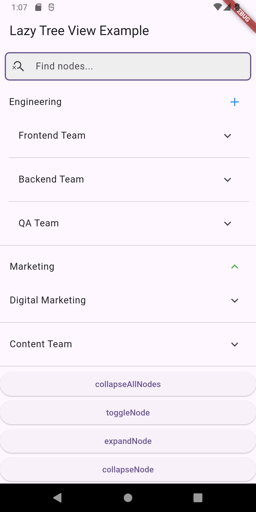

# Flutter Custom Tree View Package 🌳

A highly customizable tree view widget with advanced features for Flutter applications.

### Screenshot With Search Activated
 


## Features ✨
- **Hierarchical tree structure** with unlimited nesting levels
- **Fully customizable UI** for each node
- **Built-in search** with filtering capabilities
- **Lazy loading** support for dynamic data
- **Path tracking** for node selection
- **Programmatic control** of expansion/collapse
- **Divider support** between nodes
- **Material Design** compliant with customization options
- **Root node toggle** visibility control
- **Responsive design** works on all screen sizes

## Installation 📦
Add to your `pubspec.yaml`:
```yaml
dependencies:
  flutter_custom_tree_view: ^2.0.0
```
## Basic Usage 🚀
```dart
 import 'package:flutter_custom_tree_view/flutter_custom_tree_view.dart';
final rootNode = TreeNode(
  title: 'Company Structure',
  key: 'root',
  customUi: TreeNodeUi(
    title: Text('Company Structure', style: TextStyle(fontWeight: FontWeight.bold)),
    leading: Icon(Icons.business),
    backgroundColor: Colors.blue[50],
  ),
  preLoadedChildren: [
    TreeNode(
      title: 'Engineering',
      key: 'dept_eng',
      customUi: TreeNodeUi(
        iconColor: Colors.blue,
        trailing: IconButton(
          icon: Icon(Icons.add),
          onPressed: () => loadMoreItems(),
        ),
      ),
    ),
    TreeNode(
      title: 'Marketing',
      key: 'dept_mkt',
      isLastItem: true,
    ),
  ],
);

TreeViewCustom(
  root: rootNode,
  onLastItemClick: (path, node) {
    print('Selected: ${node.title} with path: $path');
  },
  onPressToLoadChildren: (node) {
    // Simulate async loading
    Future.delayed(Duration(seconds: 1), () {
      node.completer.complete([
        TreeNode(title: 'Frontend', key: 'team_fe'),
        TreeNode(title: 'Backend', key: 'team_be'),
      ]);
    });
  },
  showSearch: true,
  showRootTitle: false, // Hide root title
  divider: Divider(height: 1, color: Colors.grey[300]),
  controller: TreeViewController(), // For programmatic control
);
```
## Advanced Features 🔧
### Programmatic Control
```dart
final controller = TreeViewController();

// Expand/collapse specific nodes
controller.expandNode('node_key');
controller.collapseNode('node_key');
controller.toggleNode('node_key');

// Mass operations
controller.expandAll();
controller.collapseAll();

// Check node states
bool isExpanded = controller.isExpanded('node_key');
```
### Custom Node UI
```dart
TreeNode(
  title: 'Advanced Node',
  key: 'adv_node',
  customUi: TreeNodeUi(
    title: Container(
      padding: EdgeInsets.all(8),
      child: Row(
        children: [
          Icon(Icons.star, color: Colors.amber),
          SizedBox(width: 8),
          Text('Premium Node'),
        ],
      ),
    ),
    leading: Icon(Icons.lock),
    trailing: PopupMenuButton(
      itemBuilder: (context) => [
        PopupMenuItem(child: Text('Option 1')),
        PopupMenuItem(child: Text('Option 2')),
      ],
    ),
    backgroundColor: Colors.amber[50],
    collapsedBackgroundColor: Colors.grey[100],
    shape: RoundedRectangleBorder(
      borderRadius: BorderRadius.circular(8),
      side: BorderSide(color: Colors.amber),
    ),
    childrenPadding: EdgeInsets.only(left: 24),
  ),
)
```
### Custom Node UI
```dart
TreeViewCustom(
  // ... other params
  searchFieldUi: TreeViewSearchUi(
    hintText: 'Filter tree...',
    prefixIcon: Icon(Icons.filter_alt),
    decoration: InputDecoration(
      border: OutlineInputBorder(
        borderRadius: BorderRadius.circular(12),
      ),
      filled: true,
      fillColor: Colors.grey[50],
      contentPadding: EdgeInsets.symmetric(vertical: 12, horizontal: 16),
    ),
    style: TextStyle(fontSize: 14),
    keyboardType: TextInputType.text,
    autofocus: true,
  ),
)
```
### Custom Node UI
```dart
TreeNode(
  title: 'Dynamic Node',
  key: 'dyn_node',
  onPressToLoadChildren: (node) async {
    final data = await fetchRemoteData(node.key);
    node.completer.complete(data.map((item) => 
      TreeNode(
        title: item.name,
        key: item.id,
        value: item,
      )
    ).toList());
  },
)
```
## API Reference 📚
### TreeViewCustom Properties
| Parameter | Type | Description |
|-----------|------|-------------|
| `root` | `TreeNode` | Root node of the tree (required) |
| `onLastItemClick` | `Function(List<String>, TreeNode)` | Leaf node click callback (required) |
| `onPressToLoadChildren` | `Function(TreeNode)` | Lazy load children callback (required) |
| `showSearch` | `bool` | Toggle search field visibility |
| `searchFieldUi` | `TreeViewSearchUi?` | Search field customization |
| `controller` | `TreeViewController?` | For programmatic control |
| `divider` | `Widget?` | Divider between nodes |
| `showRootTitle` | `bool` | Show/hide root node title (default: true) |
### TreeNode Properties
| Property | Type | Description |
|-----------|------|-------------|
| `title` | `String` | Display text |
| `key` | `String` | Unique identifier (required) |
| `value` | `dynamic` | Associated data |
| `isLastItem` | `bool` | Marks as leaf node |
| `customUi` | `TreeNodeUi?` | Node styling options |
| `preLoadedChildren` | `List<TreeNode>` | Immediate child nodes |
| `completer` | `Completer<List<TreeNode>>` | For async child loading |
### TreeNode Properties
| Method  | Description |
|-----------|-------------|
| `expandNode(String key)` | `Expands specific node`| 
| `collapseNode(String key)` | `Collapses specific node`|
| `toggleNode(String key)` | `Toggles node state`|
| `expandAll()` | `Expands all nodes`|
| `collapseAll()` | `Collapses all nodes`| 
| `isExpanded(String key)` | `Checks node expansion state`| 
| `registerController` | `(Internal use)`|
| `unregisterController` | `(Internal use)`|
## Complete Examples 🏗️
[example flutter_custom_tree_view](https://github.com/NavidHosseini/flutter_custom_tree_view/blob/master/example/main.dart);


